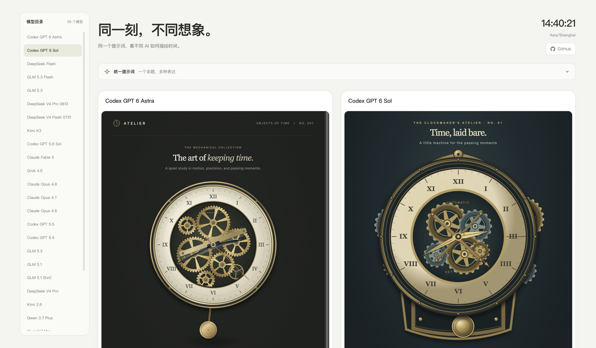

# AI Clocks

同一个提示词，看不同 AI 如何用 Canvas 绘制机械钟表。支持实时预览、放大查看和代码统计对比。

## 使用

用浏览器打开 `index.html` 即可，无需安装依赖。各模型的作品位于 `models/`，也可单独打开。

## 提示词

> Help me draw a mechanical clock using cavans and generate an HTML file that I can open directly in the browser.
